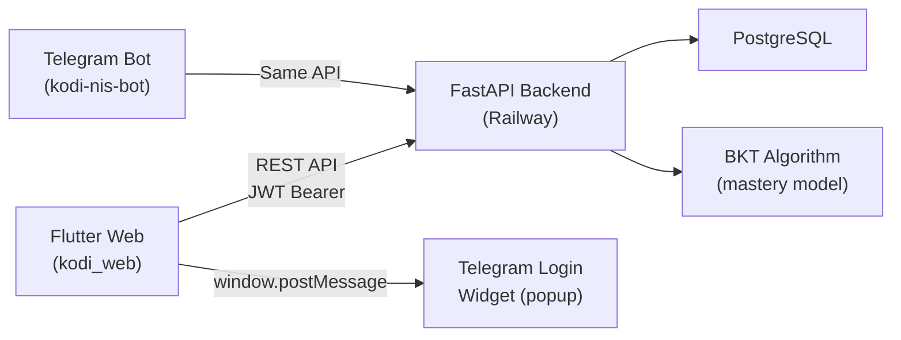
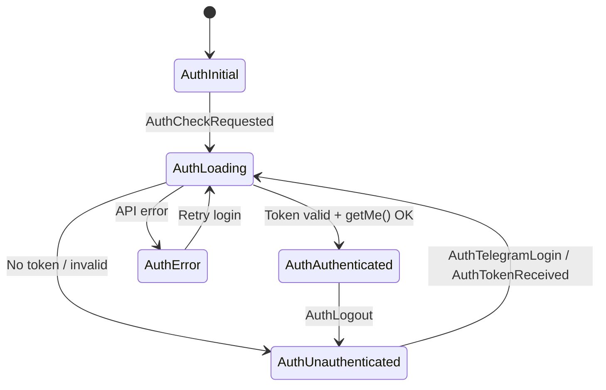
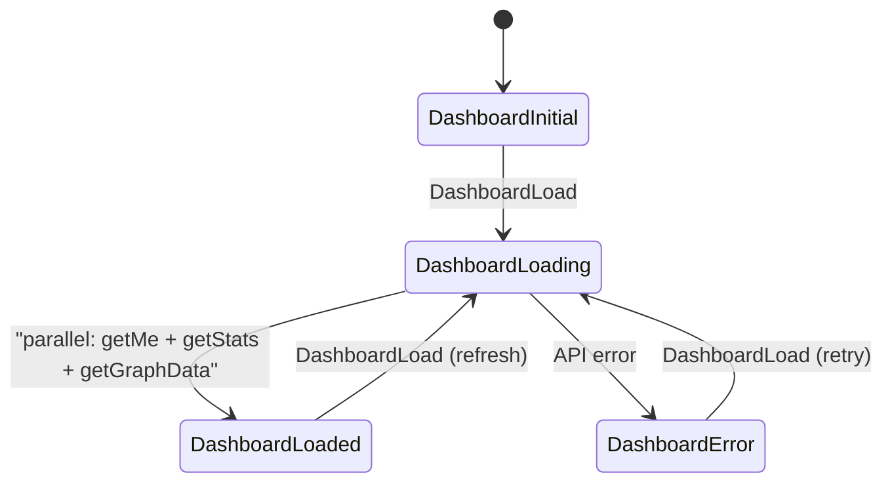
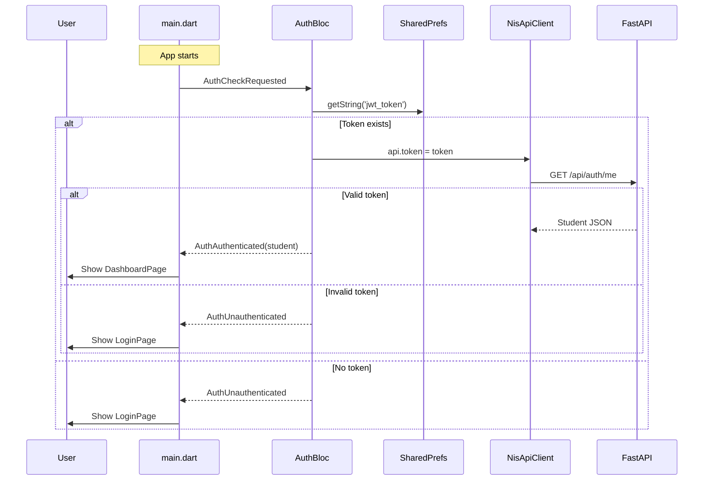
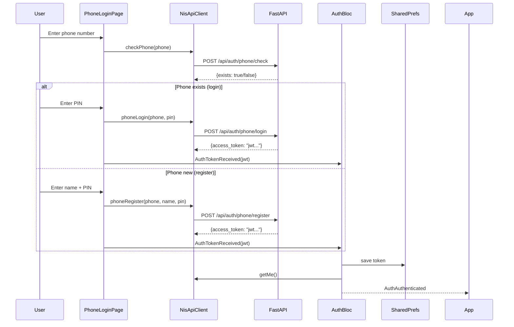
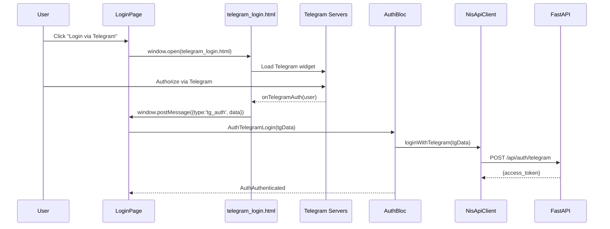

# Architecture — kodi-nis-web

> Last updated: 2026-02-23

## System Topology



The Flutter Web app and the Telegram bot share the **same FastAPI backend**. The web app is a stateless frontend — all persistence and business logic live on the backend.

---

## Monorepo Structure

```
kodi-nis-web/
├── packages/
│   └── kodi_core/                    # SHARED PACKAGE — models + API client
│       └── lib/
│           ├── kodi_core.dart        # Barrel export (re-exports everything below)
│           ├── api/
│           │   └── nis_api.dart      # HTTP client, 16 endpoints, JWT auth
│           └── models/
│               ├── student.dart      # User model
│               ├── stats.dart        # Progress statistics
│               ├── problem.dart      # Math problem + AnswerResult
│               └── graph_node.dart   # Knowledge graph node
│
├── apps/
│   └── kodi_web/                     # FLUTTER WEB APP
│       ├── web/
│       │   ├── index.html
│       │   ├── manifest.json
│       │   └── telegram_login.html   # Telegram OAuth popup
│       └── lib/
│           ├── main.dart             # App root, BLoC providers, auth gate
│           ├── app/
│           │   ├── config.dart       # API_BASE_URL, TG_BOT_NAME (--dart-define)
│           │   ├── router.dart       # onGenerateRoute — 7 routes
│           │   └── theme.dart        # Material 3 theme, colors
│           ├── features/
│           │   ├── auth/
│           │   │   ├── bloc/auth_bloc.dart       # Auth state machine
│           │   │   └── pages/
│           │   │       ├── login_page.dart        # Login shell + Telegram button
│           │   │       └── phone_login_page.dart  # Phone+PIN form
│           │   ├── dashboard/
│           │   │   ├── bloc/dashboard_bloc.dart   # Loads student+stats+graph+leaderboard
│           │   │   └── pages/
│           │   │       ├── dashboard_page.dart    # Main screen (hero, stats, sections)
│           │   │       ├── graph_page.dart        # Knowledge graph visualization
│           │   │       └── leaderboard_page.dart  # Rankings
│           │   ├── practice/
│           │   │   └── pages/practice_page.dart   # Infinite practice loop
│           │   ├── diagnostic/
│           │   │   └── pages/diagnostic_page.dart # Adaptive 15-topic assessment
│           │   └── exam/
│           │       └── pages/exam_page.dart       # Timed exam simulation
│           └── shared/
│               └── widgets/
│                   ├── problem_card.dart   # Problem display (text + math)
│                   ├── answer_input.dart   # Answer text field + buttons
│                   ├── result_card.dart    # Correct/incorrect feedback
│                   ├── report_sheet.dart   # "Report problem" bottom sheet
│                   └── math_text.dart      # LaTeX renderer (plain→LaTeX converter)
│
├── docs/
│   ├── ARCHITECTURE.md    # ← this file
│   └── CJM.md             # Customer Journey Map
│
└── AUDIT.md               # Bug/feature audit (2026-02-23)
```

---

## Dependency Graph — "Change X → Affects Y"

### Full Import Map

```mermaid
graph TD
    subgraph core ["packages/kodi_core"]
        KodiCore["kodi_core.dart\n(barrel)"]
        NisApi["api/nis_api.dart"]
        StudentModel["models/student.dart"]
        StatsModel["models/stats.dart"]
        ProblemModel["models/problem.dart"]
        GraphNodeModel["models/graph_node.dart"]
        KodiCore --> NisApi
        KodiCore --> StudentModel
        KodiCore --> StatsModel
        KodiCore --> ProblemModel
        KodiCore --> GraphNodeModel
    end

    subgraph app ["apps/kodi_web/lib/app"]
        Config["config.dart"]
        Router["router.dart"]
        Theme["theme.dart"]
    end

    subgraph blocs ["BLoCs"]
        AuthBloc["auth_bloc.dart"]
        DashBloc["dashboard_bloc.dart"]
    end

    subgraph pages ["Pages"]
        MainDart["main.dart"]
        LoginPage["login_page.dart"]
        PhoneLogin["phone_login_page.dart"]
        DashPage["dashboard_page.dart"]
        GraphPage["graph_page.dart"]
        LeaderPage["leaderboard_page.dart"]
        PracticePage["practice_page.dart"]
        DiagPage["diagnostic_page.dart"]
        ExamPage["exam_page.dart"]
    end

    subgraph widgets ["Shared Widgets"]
        ProblemCard["problem_card.dart"]
        AnswerInput["answer_input.dart"]
        ResultCard["result_card.dart"]
        ReportSheet["report_sheet.dart"]
        MathText["math_text.dart"]
    end

    MainDart --> KodiCore
    MainDart --> Config
    MainDart --> Router
    MainDart --> Theme
    MainDart --> AuthBloc
    MainDart --> DashBloc
    MainDart --> LoginPage
    MainDart --> DashPage

    Router --> LoginPage
    Router --> DashPage
    Router --> GraphPage
    Router --> LeaderPage
    Router --> PracticePage
    Router --> DiagPage
    Router --> ExamPage

    AuthBloc --> KodiCore
    DashBloc --> KodiCore

    LoginPage --> AuthBloc
    LoginPage --> PhoneLogin
    LoginPage --> Config
    PhoneLogin --> KodiCore
    PhoneLogin --> AuthBloc

    DashPage --> DashBloc
    DashPage --> AuthBloc
    DashPage --> KodiCore
    GraphPage --> DashBloc
    GraphPage --> KodiCore

    PracticePage --> Config
    PracticePage --> KodiCore
    PracticePage --> ProblemCard
    PracticePage --> AnswerInput
    PracticePage --> ResultCard
    PracticePage --> ReportSheet

    DiagPage --> Config
    DiagPage --> KodiCore
    DiagPage --> ProblemCard
    DiagPage --> AnswerInput
    DiagPage --> ResultCard
    DiagPage --> ReportSheet
    DiagPage --> MathText

    ExamPage --> Config
    ExamPage --> KodiCore
    ExamPage --> ProblemCard
    ExamPage --> AnswerInput
    ExamPage --> ResultCard
    ExamPage --> ReportSheet

    ProblemCard --> MathText
    ResultCard --> MathText
    ReportSheet --> KodiCore
```



### Impact Matrix

| If you change... | It affects... |
|---|---|
| `nis_api.dart` (API client) | **ALL features** — auth, dashboard, practice, diagnostic, exam |
| `student.dart` | AuthBloc, DashboardBloc, DashboardPage, GraphPage (any page showing user info) |
| `stats.dart` | DashboardBloc, DashboardPage (hero card, stats row) |
| `problem.dart` / `AnswerResult` | PracticePage, DiagnosticPage, ExamPage, ResultCard |
| `graph_node.dart` | DashboardBloc, DashboardPage (sections), GraphPage |
| `config.dart` | Every API call in the app (6 NisApiClient instances) |
| `router.dart` | All navigation — 7 routes, breaks any `pushNamed` call |
| `theme.dart` | Visual appearance of entire app |
| `auth_bloc.dart` | Login flow, auto-login, logout, token persistence |
| `dashboard_bloc.dart` | Dashboard data, graph page, leaderboard data |
| `problem_card.dart` | Problem display in Practice, Diagnostic, Exam |
| `answer_input.dart` | Answer UI in Practice, Diagnostic, Exam |
| `result_card.dart` | Feedback display in Practice, Diagnostic, Exam |
| `math_text.dart` | All math rendering — problem text, solutions, answers |
| `report_sheet.dart` | Report-a-problem in Practice, Diagnostic, Exam |
| `login_page.dart` | Login screen only (+ phone_login_page.dart embedded in it) |
| `dashboard_page.dart` | Main dashboard only (but has 1163 lines — largest file) |
| `practice_page.dart` | Practice mode only |
| `diagnostic_page.dart` | Diagnostic mode only |
| `exam_page.dart` | Exam mode only |
| `graph_page.dart` | Knowledge graph view only |
| `telegram_login.html` | Telegram OAuth popup only |

---

## State Management

### BLoC Architecture





### Provider Tree (main.dart)

```
MultiRepositoryProvider
  └── NisApiClient (single shared instance)
      └── MultiBlocProvider
          ├── AuthBloc (uses shared NisApiClient)
          └── DashboardBloc (uses shared NisApiClient)
              └── MaterialApp
                  └── BlocBuilder<AuthBloc>
                      ├── AuthAuthenticated → DashboardPage
                      ├── AuthUnauthenticated → LoginPage
                      └── _ → Loading spinner
```

**Known issue:** PracticePage, DiagnosticPage, and ExamPage create their own `NisApiClient` instances in `initState()` and read the JWT token from `SharedPreferences` manually, bypassing the shared `RepositoryProvider` instance. This means:
- Token changes in AuthBloc are NOT reflected in these pages until they re-init
- There are 4 separate NisApiClient instances alive simultaneously

---

## API Contract

Base URL: `AppConfig.apiBaseUrl` (default `http://localhost:8000`, set via `--dart-define`)

### Authentication

| Method | Path | Auth | Used by | Returns |
|--------|------|------|---------|---------|
| POST | `/api/auth/telegram` | No | LoginPage (Telegram) | `{access_token}` |
| POST | `/api/auth/phone/check` | No | PhoneLoginPage | `{exists: bool}` |
| POST | `/api/auth/phone/register` | No | PhoneLoginPage | `{access_token}` |
| POST | `/api/auth/phone/login` | No | PhoneLoginPage | `{access_token}` |
| GET | `/api/auth/me` | JWT | AuthBloc, DashboardBloc | `Student` JSON |

### Data

| Method | Path | Auth | Used by | Returns |
|--------|------|------|---------|---------|
| GET | `/api/stats/me?lang=ru` | JWT | DashboardBloc | `Stats` JSON |
| GET | `/api/graph/me?lang=ru` | JWT | DashboardBloc | `{nodes: [], leaderboard: []}` |

### Practice

| Method | Path | Auth | Used by | Returns |
|--------|------|------|---------|---------|
| GET | `/api/practice/next?count=N&lang=ru&tag=X&node_id=Y` | JWT | PracticePage | `Problem` JSON |
| POST | `/api/practice/answer?lang=ru` | JWT | PracticePage, ExamPage | `AnswerResult` JSON |
| POST | `/api/practice/skip` | JWT | PracticePage | — |
| POST | `/api/practice/exam/start` | JWT | ExamPage | `{problems: [...]}` |
| POST | `/api/practice/report` | JWT | ReportSheet | — |

### Diagnostic

| Method | Path | Auth | Used by | Returns |
|--------|------|------|---------|---------|
| POST | `/api/diagnostic/start` | JWT | DiagnosticPage | First question JSON |
| GET | `/api/diagnostic/question` | JWT | DiagnosticPage | Question JSON |
| POST | `/api/diagnostic/answer` | JWT | DiagnosticPage | Result + has_next |
| POST | `/api/diagnostic/finish` | JWT | DiagnosticPage | Summary + mastered/failed nodes |
| GET | `/api/diagnostic/status` | JWT | DiagnosticPage | Current diagnostic state |

---

## Routing

Defined in `router.dart` via `onGenerateRoute`:

| Route | Page | Arguments |
|-------|------|-----------|
| `/` | DashboardPage | — |
| `/login` | LoginPage | — |
| `/practice` | PracticePage | `{tag?, tagName?, nodeId?}` |
| `/graph` | GraphPage | — |
| `/diagnostic` | DiagnosticPage | — |
| `/leaderboard` | LeaderboardPage | `List<LeaderboardEntry>` |
| `/exam` | ExamPage | — |

Navigation uses `Navigator.pushNamed()` with `.then(() => DashboardBloc.add(DashboardLoad()))` to refresh dashboard on return.

---

## Data Models

### Student
Fields: `id`, `firstName`, `lastName`, `username`, `fullName`, `lang`, `registered`, `diagnosticComplete`

### Stats
Fields: `solved`, `correct`, `accuracy`, `avgTimeS`, `masteredCount`, `totalNodes`, `currentStreak`, `longestStreak`
Computed: `masteryPercent` = masteredCount / totalNodes

### Problem
Fields: `problemId`, `nodeId`, `nodeName`, `text`, `imagePath`, `answerType`, `difficulty`, `subDifficulty`, `count`

### AnswerResult
Fields: `isCorrect`, `correctAnswer`, `solution`, `pMastery`, `isMastered`, `llmNote`

### GraphNode
Fields: `id`, `nameRu`, `nameKz`, `tag`, `zone`, `status`, `pMastery`, `isFringe`, `isBlocked`, `difficulty`, `downstream`, `qTotal`, `qCorrect`
Status values: `mastered` | `partial` | `failed` | `untested`

---

## Authentication Flow



### Phone Login Flow



### Telegram Login Flow



---

## Configuration

Set via `--dart-define` at build/run time:

```bash
flutter run -d chrome \
  --dart-define=API_BASE_URL=https://your-api.railway.app \
  --dart-define=TG_BOT_NAME=nis_math_test_bot
```

| Variable | Default | Used in |
|----------|---------|---------|
| `API_BASE_URL` | `http://localhost:8000` | `config.dart` → all NisApiClient instances |
| `TG_BOT_NAME` | `nis_math_test_bot` | `config.dart` → `login_page.dart` → `telegram_login.html` |
