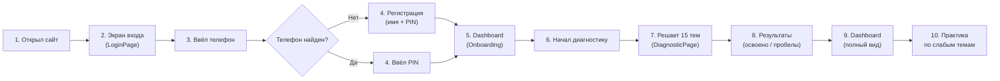
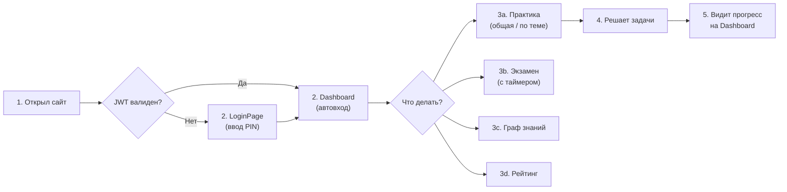
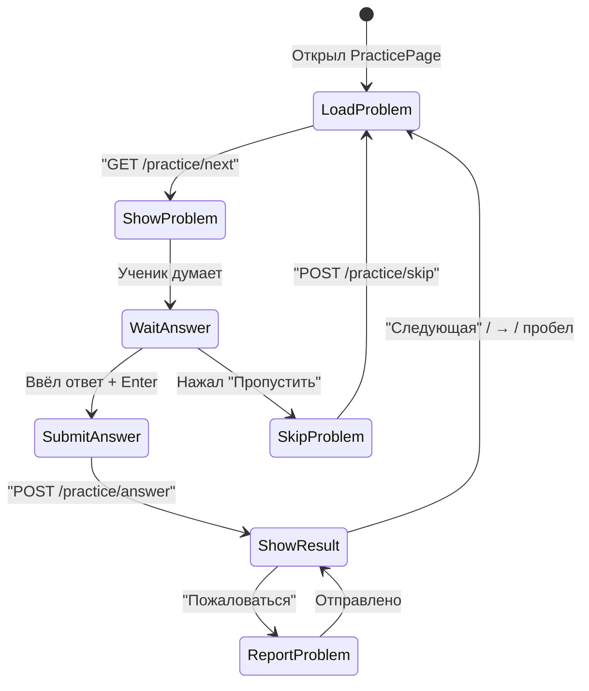
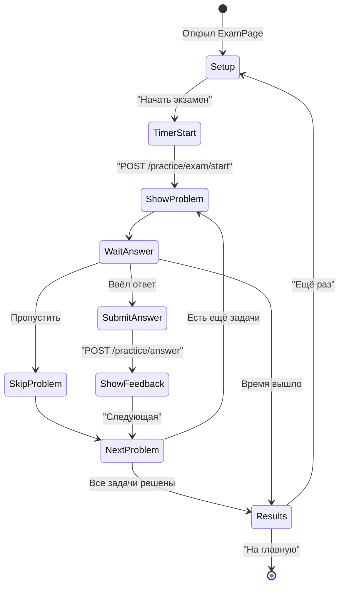
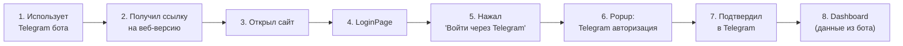
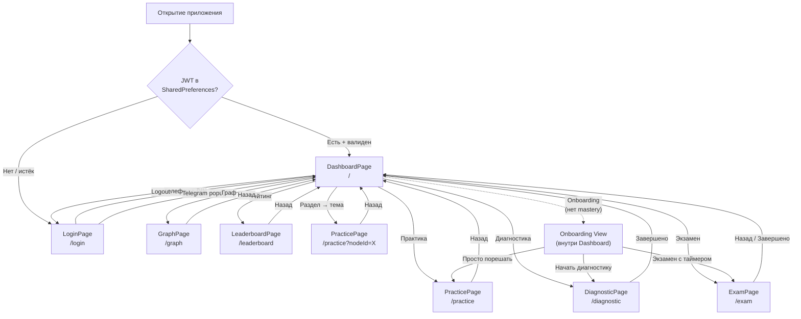

# Customer Journey Map — NIS Math Web

> Last updated: 2026-02-23

## Overview

NIS Math — веб-приложение для подготовки к математическому экзамену в НИШ (Назарбаев Интеллектуальные Школы). Целевая аудитория: ученики 5-6 классов и их родители.

---

## Journey 1: Новый ученик (первый визит)

### Точки контакта

### Детальный путь

| Шаг | Экран | Действие пользователя | Ответ системы | Эмоция |
|-----|-------|----------------------|---------------|--------|
| 1 | — | Открывает сайт | Проверяет JWT → нет токена | Ожидание |
| 2 | LoginPage | Видит форму входа | Показывает поле телефона + кнопку Telegram | Нейтрально |
| 3 | PhoneLoginPage | Вводит номер (+7...), нажимает "Продолжить" | `POST /api/auth/phone/check` → "Новый ученик!" | Интерес |
| 4 | PhoneLoginPage | Вводит имя и придумывает 4-значный PIN | `POST /api/auth/phone/register` → JWT | Вовлечённость |
| 5 | DashboardPage (Onboarding) | Видит приветствие и 3 шага | Показывает карточки: диагностика → пробелы → тренировка | Мотивация |
| 6 | DashboardPage | Нажимает "Начать диагностику" | Переход на `/diagnostic` | Готовность |
| 7 | DiagnosticPage | Решает задачи (по 1 на тему, 15 тем) | Адаптивный BKT: подбирает сложность | Концентрация |
| 8 | DiagnosticPage (Results) | Видит результаты | Список освоенных и слабых тем | Понимание |
| 9 | DashboardPage | Возвращается на главную | Полный dashboard с разделами, процентами, статистикой | Удовлетворение |
| 10 | PracticePage | Выбирает слабую тему, решает задачи | Бесконечный цикл: задача → ответ → обратная связь | Рост |

### Болевые точки (из AUDIT.md)

- **BUG-1**: После возврата из практики по теме dashboard НЕ обновляется — ученик не видит свой прогресс
- **MISS-3**: Нет выбора языка (RU/KZ) — казахоязычные ученики видят всё на русском
- **MISS-6**: Нет offline handling — если пропал интернет, ничего не показывается

---

## Journey 2: Возвращающийся ученик

### Точки контакта

### Детальный путь

| Шаг | Экран | Действие пользователя | Ответ системы | Эмоция |
|-----|-------|----------------------|---------------|--------|
| 1 | — | Открывает сайт | `AuthCheckRequested` → JWT из SharedPreferences → `GET /api/auth/me` | Ожидание |
| 2a | DashboardPage | Видит свой прогресс | Параллельная загрузка: student + stats + graph + leaderboard | Узнавание |
| 2b | LoginPage | (если токен истёк) Вводит телефон + PIN | `POST /api/auth/phone/login` → JWT | Небольшое раздражение |
| 3a | — | Нажимает "Практика" | Переход на `/practice` (общая) | Готовность |
| 3a' | — | Раскрывает раздел → нажимает на тему | Переход на `/practice?nodeId=X` (по теме) | Целенаправленность |
| 3b | — | Нажимает "Экзамен" | Переход на `/exam`, выбирает 10/20/30 задач | Волнение |
| 3c | — | Нажимает "Граф" (в AppBar) | Переход на `/graph` — все темы по категориям | Обзор |
| 3d | — | Нажимает "Рейтинг" | Переход на `/leaderboard` — сравнение с другими | Соревновательность |
| 4 | PracticePage | Решает задачи, видит обратную связь | Задача → ответ → правильно/неправильно + решение + mastery bar | Обучение |
| 5 | DashboardPage | Возвращается | Dashboard перезагружается (`.then(DashboardLoad)`) | Прогресс |

### Ключевые сценарии практики

### Ключевые сценарии экзамена

---

## Journey 3: Ученик из Telegram-бота

### Точки контакта

### Детальный путь

| Шаг | Экран | Действие пользователя | Ответ системы | Эмоция |
|-----|-------|----------------------|---------------|--------|
| 1 | Telegram | Пользуется ботом `@nis_math_test_bot` | — | Привычка |
| 2 | Telegram | Получает ссылку или видит кнопку "Веб-версия" | — | Любопытство |
| 3 | — | Открывает сайт | Проверяет JWT → нет | Ожидание |
| 4 | LoginPage | Видит форму входа | Два варианта: телефон / Telegram | Выбор |
| 5 | LoginPage | Нажимает "Войти через Telegram" | `window.open(telegram_login.html?bot=...)` — popup 400x500 | Привычность |
| 6 | Popup | Видит Telegram Login Widget | Telegram загружает виджет авторизации | Узнавание |
| 7 | Popup | Нажимает "Authorize" в Telegram | `onTelegramAuth(user)` → `postMessage` → popup закрывается | Быстрота |
| 8 | DashboardPage | Видит свои данные из бота | `POST /api/auth/telegram` → JWT → `GET /api/auth/me` → данные | Удовлетворение |

### Особенности

- Telegram и веб-версия делят **одну и ту же базу данных** — прогресс синхронизирован
- Telegram-аккаунт связывается с тем же Student, что и в боте
- Ученик может переключаться между Telegram-ботом и веб-версией без потери данных

---

## Карта экранов и переходов

---

## Метрики пути пользователя

### Ключевые конверсии

| Этап | Метрика | Как измерить |
|------|---------|-------------|
| Регистрация | % посетителей → зарегистрировались | phone/register или telegram auth |
| Onboarding | % зарегистрированных → начали диагностику | diagnostic/start после registration |
| Первая практика | % завершивших диагностику → начали практику | practice/next после diagnostic/finish |
| Ретеншен | % вернувшихся на следующий день | currentStreak > 0 |
| Мастерство | % тем со статусом mastered | masteredCount / totalNodes |

### Время на ключевых экранах

| Экран | Ожидаемое время | Максимум |
|-------|----------------|----------|
| LoginPage | 30-60 сек | 2 мин |
| Diagnostic | 10-15 мин | 30 мин |
| Practice (сессия) | 5-20 мин | без ограничений |
| Exam | 20-60 мин (по настройке) | время по таймеру |
| Dashboard | 10-30 сек (обзор) | — |

---

## Болевые точки и возможности

| ID | Проблема | Где в пути | Влияние | Статус |
|----|---------|-----------|---------|--------|
| BUG-1 | Dashboard не обновляется после возврата из темы/секции | Journey 2, шаг 5 | Ученик не видит свой прогресс | Открыт |
| BUG-4 | LaTeX не парсит сложные выражения | Journey 2, шаг 4 | Задача отображается некорректно | Открыт |
| MISS-1 | Нет кнопки "Пожаловаться" в диагностике | Journey 1, шаг 7 | Нельзя сообщить об ошибке в задаче | Открыт |
| MISS-2 | Нет решения после неправильного ответа в диагностике | Journey 1, шаг 7 | Ученик не понимает ошибку | Открыт |
| MISS-3 | Нет выбора языка RU/KZ | Все пути | Казахоязычные ученики без поддержки | Открыт |
| MISS-4 | Нет профиля пользователя | Journey 2 | Нельзя изменить имя/настройки | Открыт |
| MISS-5 | Нет pull-to-refresh | Journey 2, шаг 2a | Застаревшие данные | Открыт |
| MISS-6 | Нет offline handling | Все пути | Белый экран без интернета | Открыт |
